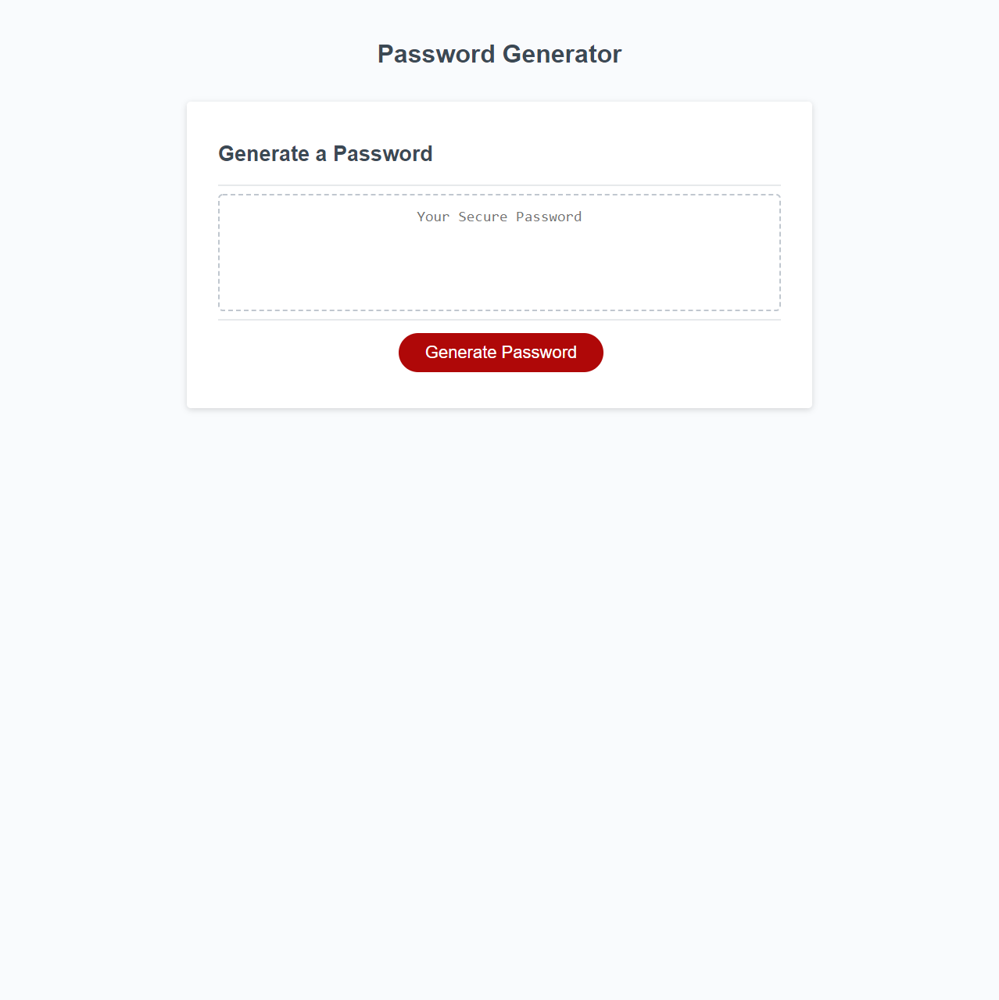

# Password-Generator

- this is a password generator made using the provided html and css, with JavaScript added.
- it does not nessisarily provide a secure password but it will provide the user with a password at any length the user chooses from 8-128 charachters, that can be coppied and pasted where desired.

[Live-URL](https://billygm.github.io/Password-Generator/)

[GitHub-URL](https://github.com/Billygm/Password-Generator)